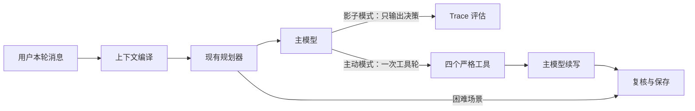

# 天之灵主模型自主工具方案

## 目标与原则

目标不是把聊天逻辑继续程序化，而是让主模型在真正需要信息时即时取用少量上下文。聊天质量和事实可信度优先，其次才是 Token、延迟与服务资源成本。

本方案遵守四条工程原则：

1. 普通消息不注入工具说明，也不增加模型调用。
2. 工具按职责拆分，不提供一个可以任意查库或任意写入的通用工具。
3. 先观察决策，再小流量执行，最后才按场景退出前置规划。
4. 风险、现实依赖、多对象歧义和复合意图始终可退回现有规划路径。

## 已落地架构



当前默认是 `shadow`，抽样率 20%；`active` 抽样率默认为 0，因此代码具备执行能力但不会自行放量。影子决策复用主回复的同一次模型调用，不新增线上模型请求。

主动模式命中安全抽样时，应用不再执行原规划器的长期记忆预取，由主模型按需要调用工具；最多一轮、最多四次工具执行。主模型不调用工具时仍只有一次生成调用，调用后增加一次续写调用。

## 工具职责

| 工具 | 读取或写入范围 | 明确禁止 |
| --- | --- | --- |
| `search_relationship_memory` | 按最多四个缺失概念检索共同记忆 | 按触发词盲查、重复查询近期已有事实 |
| `get_family_facts` | 读取已确认家庭关系与当前值 | 推断共同经历、补全未知家庭事实 |
| `get_persona_evidence` | 读取语气、用词、性格、价值观和习惯证据 | 提供现实事实或共同经历 |
| `record_user_correction` | 记录用户本轮明确否定及明确替代事实 | 根据模型猜测写入、没有纠正也写入 |

四个工具均使用严格 JSON Schema：对象禁止额外字段，字段完整，数组数量、字符串长度和返回条数受限。服务端再次校验参数，不修补非法参数。

每条返回证据统一包含：

- `source`：资料来源。
- `sourceAt`：来源时间；旧资料无时间时为空字符串，不伪造时间。
- `confidence`：0 到 1 的可信度。
- `conflictStatus`：`none/conflicted/superseded/unknown`。
- `subjectRef/factKey`：可用时标明对象和事实槽位。
- `value`：经过长度限制的证据正文。

工具结果进入主模型后还会转换为现有 `evidence_atom_v1`，供事实复核使用。共同记忆保持 `retrieved_user/recall`，家庭事实和人物证据在无冲突时才允许陈述；这样检索、生成和裁判不会各用一套证据口径。

纠正写入还有第二层门槛：用户原话必须包含明确否定，`rejectedFact` 必须出现在用户本轮或上一条助手回复，`replacementFact` 必须来自用户本轮。否则返回 `denied`，不落库。

## 三阶段放量

### P0：影子观察，当前默认

- 只抽样复杂、记忆、家庭、纠正或严格事实场景。
- 普通短消息不出现工具名称或工具 Schema。
- 主模型在正常回复 JSON 中附带最多两项 `toolDecisions`；回复照常生成。
- 判断时把规划器刚取回的长期检索结果视为“尚未提供”，避免已有预取掩盖模型本来的查询需求。
- Trace 记录决策工具、非法参数数、规划器是否查询以及双方是否一致。

进入 P1 前至少积累 500 个合格影子轮，并人工标注其中 100 个。门槛：

| 指标 | 门槛 |
| --- | --- |
| 应查询场景工具召回率 | 不低于 90% |
| 不应查询场景正确跳过率 | 不低于 95% |
| 查询对象正确率 | 不低于 95% |
| 缺失概念覆盖率 | 不低于 85% |
| 非法参数率 | 不高于 2% |
| 抽样轮平均新增输出 Token | 不高于 35 |
| 情感质量与事实质量 | 不低于对照版本 |

### P1：小流量主动调用，代码已具备、默认关闭

- 设置 `NODE_CHAT_TOOLS_MODE=active`，从 `activeSampleRate=0.01` 起步。
- 命中主动轮后，原长期记忆预取记为 `tool_takeover` 并跳过，避免重复查。
- 风险、现实依赖、多对象歧义或超过两个意图的场景进入 `planner_fallback`，不开放工具执行。
- 工具超时默认 2500ms；失败结果交给模型自然降级，不循环重试工具。
- 每轮最多一轮工具交互，避免模型循环调用和 CPU、连接池压力。

放量顺序建议为 1%、5%、20%、50%。每档至少覆盖 300 个主动轮和一个完整业务高峰。继续放量的门槛：

| 指标 | 门槛 |
| --- | --- |
| 必要记忆取回率 | 不低于现有规划器，且不低于 90% |
| 无效工具调用率 | 不高于 8% |
| 返回证据实际使用率 | 不低于 70% |
| 无依据事实率、纠正复发率 | 不高于对照版本 |
| 主动轮 P95 新增延迟 | 不高于 1.8 秒 |
| 全量平均模型调用增量 | 由抽样控制在 0.15 次以内 |
| 工具 P95 执行时间 | 不高于 500ms |

### P2：按场景退出前置规划，尚不自动开启

P2 不采用一次性删除规划器，而是建立场景白名单：先让单一记忆询问、单一家庭事实和明确纠正绕过前置语义规划；复杂关系、多对象、现实依赖与风险场景继续走规划器。

每个场景独立达到连续两周质量门槛后才进入白名单。若任一版本的必要记忆取回率下降 3 个百分点、事实失败率上升 1 个百分点或 P95 延迟超限，立即退回 P1。规划器代码长期保留为困难场景和故障回退，不作为每轮固定成本。

## 追踪与评测

不在 Span 保存聊天正文、工具参数或工具结果正文，只保存短指标：

- `chatToolMode`、`decisionNames`、`decisionCount`。
- `plannerMemoryRequested`、`plannerMemoryAgreement`。
- `invalidDecisionCount`、`executionCount`、`resultItemCount`。
- 每次模型请求的 `toolCount`、`toolChoice`、Token 和耗时。
- 每个真实工具的独立阶段耗时。

`plannerMemoryAgreement` 只表示决策关系，不直接代表谁正确：

- `both_query`：双方都认为要查。
- `both_skip`：双方都认为不用查。
- `model_only`：模型认为缺信息，规划器未查。
- `planner_only`：规划器查了，模型认为无需查。

评测必须加入人工金标“这轮是否真的缺信息”，否则一致率只能测相似，不能测质量。记忆质量继续分开统计写入、召回、证据正确性、自然使用和纠正后的失效，不能用单一召回率代替聊天体验。

## 配置与回滚

```dotenv
NODE_CHAT_TOOLS_MODE=shadow
NODE_CHAT_TOOLS_SHADOW_SAMPLE_RATE=0.2
NODE_CHAT_TOOLS_ACTIVE_SAMPLE_RATE=0
NODE_CHAT_TOOLS_MAX_CALLS_PER_TURN=4
NODE_CHAT_TOOLS_TIMEOUT_MS=2500
```

紧急回滚只需把 `NODE_CHAT_TOOLS_MODE` 改为 `off`。质量异常但仍需观察时改回 `shadow`；该模式不执行工具，也不会新增模型调用。配置切换前后都应按发布版本比较 Token、模型调用数、延迟、事实失败和情感体验。

## 本轮验收范围

- 已完成四个严格工具协议和服务端二次校验。
- 已完成统一证据返回格式、工具超时和单轮上限。
- 已完成影子输出、规划器对照指标及 Trace 记录。
- 已完成主动调用与续写链路，默认流量为 0。
- 已完成主动轮长期记忆预取退出和困难场景回退。
- 未自动开启 P1，也未跳过整个复杂语义规划器；这两项必须由真实影子数据达到门槛后逐档推进。
