# TianZhiLing 数据库关系解释文档

本文面向 AI 阅读，用来快速理解 TianZhiLing 项目的数据库结构、逻辑关系和主要业务流。

生成依据主要来自：

- `packages/entities/src/*.entity.ts`
- `packages/entities/src/base.ts`
- `apps/node/src/service/*.ts`
- `apps/admin-node/src/service/*.ts`
- `apps/node/src/service/rag/*.ts`

## 1. 总体结论

项目主数据库是 MongoDB，通过 Midway + TypeORM `MongoRepository` 访问。

虽然代码里叫 `Entity`，但这里不是关系型数据库建模：

- 每个实体对应一个 MongoDB collection。
- `BaseEntity.id` 使用 `@ObjectIdColumn()`，实际对应 MongoDB `_id:ObjectId`。
- 实体之间没有数据库外键，也没有 TypeORM `@ManyToOne`、`@OneToMany` 关系装饰器。
- 所有关系都是服务层用 `userId`、`agentId`、`conversationId`、`orderId` 等字段手动维护的逻辑关系。
- 许多展示字段是快照或冗余字段，例如订单 `snapshot`、通知里的 `actorName`、`postThumbnail`，不能当作主数据源。

重要兼容提醒：

- 后端字段和接口要兼容已发布的小程序客户端，尽量做新增字段，不要随意删除或重命名字段。
- TypeORM 的 `MongoRepository.count()` 在本项目里应传 Mongo 原生查询对象，例如 `model.count({ userId, isRead: false })`，不要写成 `{ where: ... }`。

## 2. Collection 总览

| 领域 | Collection | Entity | 作用 |
| --- | --- | --- | --- |
| 用户 | `user` | `UserEntity` | 前台用户资料 |
| 用户 | `user_account` | `UserAccountEntity` | 前台登录账号，手机号或微信 openid 映射 |
| 管理员 | `admin_user` | `AdminUserEntity` | 后台管理员资料和角色 |
| 管理员 | `admin_account` | `AdminAccountEntity` | 后台登录账号和密码 |
| AI 亲友 | `agent` | `AgentEntity` | 用户创建的亲友 Agent 档案 |
| AI 亲友 | `agent_profile_fact` | `AgentProfileFactEntity` | Agent 的结构化长期事实和人工资料来源 |
| AI 亲友 | `agent_memory_fact` | `AgentMemoryFactEntity` | 兼容性的规则化记忆事实 |
| AI 亲友 | `agent_relationship_signal` | `AgentRelationshipSignalEntity` | 用户和 Agent 的关系连续性信号 |
| AI 亲友 | `agent_sub` | `AgentSubEntity` | Agent 子身份配置，当前代码观察到使用较少 |
| 聊天 | `conversation` | `ConversationEntity` | 用户和 Agent 的会话容器 |
| 聊天 | `message` | `MessageEntity` | 会话消息，含文本、语音、图片、token 用量 |
| 社区 | `post` | `PostEntity` | 用户动态 |
| 社区 | `post_comment` | `PostCommentEntity` | 动态评论，评论者可以是用户或 Agent |
| 社区 | `post_like` | `PostLikeEntity` | 动态点赞 |
| 社区 | `post_comment_notification` | `PostCommentNotificationEntity` | 评论通知旧集合，仍参与合并展示 |
| 社区 | `post_notification` | `PostNotificationEntity` | 动态统一通知，包含评论和点赞 |
| 会员 | `vip_plan` | `VipPlanEntity` | 会员套餐配置 |
| 订单 | `order` | `OrderEntity` | 会员和声音包订单 |
| 会员 | `user_membership` | `UserMembershipEntity` | 用户会员权益实例 |
| 会员 | `agent_entitlement` | `AgentEntitlementEntity` | Agent 相关权益额度 |
| 优惠 | `coupon_ledger` | `CouponLedgerEntity` | 优惠/代金流水，当前代码观察到尚未形成完整写入闭环 |
| 声音服务 | `voice_package` | `VoicePackageEntity` | 声音克隆套餐配置 |
| 声音服务 | `voice_training_task` | `VoiceTrainingTaskEntity` | 声音训练任务 |
| 声音服务 | `voice_timbre` | `VoiceTimbreEntity` | 可用于 Agent 语音回复的音色 |

## 3. 逻辑关系图

以下是逻辑 ER 图，不代表数据库外键约束。

```mermaid
erDiagram
  user ||--o{ user_account : "id = userId"
  user ||--o{ agent : "id = createdUserId"
  user ||--o{ agent_profile_fact : "id = userId"
  agent ||--o{ agent_profile_fact : "id = agentId"
  user ||--o{ agent_memory_fact : "id = userId"
  agent ||--o{ agent_memory_fact : "id = agentId"
  user ||--o{ agent_relationship_signal : "id = userId"
  agent ||--o{ agent_relationship_signal : "id = agentId"
  user ||--o{ conversation : "id = userId"
  agent ||--o{ conversation : "id = agentId"
  conversation ||--o{ message : "id = conversationId"
  user ||--o{ message : "id = userId"
  agent ||--o{ message : "id = agentId"
  voice_timbre ||--o{ agent : "id = voiceTimbreId"

  user ||--o{ post : "id = userId"
  post ||--o{ post_comment : "id = postId"
  post ||--o{ post_like : "id = postId"
  user ||--o{ post_like : "id = userId"
  post_comment ||--o{ post_comment_notification : "id = commentId"
  post_comment ||--o{ post_notification : "id = commentId"

  user ||--o{ order : "id = userId"
  vip_plan ||--o{ order : "id = targetId when orderType=vip_plan"
  voice_package ||--o{ order : "id = targetId when orderType=voice_package"
  agent ||--o{ order : "id = agentId for voice_package"
  order ||--o| user_membership : "latest id = sourceOrderId"
  vip_plan ||--o{ user_membership : "id = vipPlanId"
  order ||--o{ agent_entitlement : "id = sourceOrderId"
  vip_plan ||--o{ agent_entitlement : "id = sourceVipPlanId"
  order ||--o| voice_training_task : "id = orderId"
  voice_package ||--o{ voice_training_task : "id = voicePackageId"
  agent ||--o{ voice_training_task : "id = agentId"
  voice_timbre ||--o{ voice_training_task : "id = voiceTimbreId"

  admin_user ||--o{ admin_account : "id = adminUserId"
```

## 4. 公共约定

### 4.1 ID 字段

- 所有实体继承 `BaseEntity`，都有 `id: MongoObjectId`。
- 在 MongoDB 里实际字段是 `_id`。
- 服务层查询时经常同时兼容 `id` 和 `_id`，例如先查 `{ id: objectId }`，再查 `{ _id: objectId }`。
- API 入参里的 id 通常是字符串，服务层会用 `new MongoObjectId(id)` 转换。

### 4.2 时间字段

大部分 collection 都有：

- `createdAt: Date`
- `updatedAt: Date`

有些字段是业务时间：

- `order.paidAt`、`closedAt`、`refundedAt`
- `user_membership.startedAt`、`expiredAt`
- `agent_entitlement.activatedAt`、`expiredAt`
- `voice_training_task.paidAt`、`completedAt`
- `notification.readAt`

### 4.3 冗余和快照

以下字段是为了展示、历史价格、性能或兼容而冗余：

- `order.snapshot.vipPlan`
- `order.snapshot.voicePackage`
- `order.snapshot.agent`
- `order.targetCode`
- `user_membership.vipPlanCode`
- `voice_training_task.voicePackageCode`
- `post_notification.actorName`
- `post_notification.actorAvatar`
- `post_notification.contentPreview`
- `post_comment_notification.actorName`
- `post_comment_notification.commentPreview`

AI 分析数据时应优先把真实主对象作为主数据，快照用于历史订单和展示兼容。

## 5. 用户和账号

### `user`

主字段：

- `name`
- `avatar`
- `phone`
- `phoneVerified`
- `gender`: `male | female | unknown`
- `region`: 中国省市结构，可为空
- `preferences.contactsCoverImage`

关系：

- `user.id -> user_account.userId`
- `user.id -> agent.createdUserId`
- `user.id -> conversation.userId`
- `user.id -> order.userId`
- `user.id -> post.userId`
- `user.id -> user_membership.userId`
- `user.id -> agent_entitlement.userId`

### `user_account`

主字段：

- `userId -> user.id`
- `account`: 手机号或微信账号标识
- `password`: 可为空，手机号验证码和微信登录场景常为空
- `openId`: 微信小程序 openid，可为空

登录逻辑：

- 手机号登录会按 `account = phone` 找账号。
- 微信登录会按 `openId` 或 `account = weapp:<hash>` 找账号。
- 微信绑定手机号时，可能把临时微信账号重新绑定到手机号用户上。

注意：

- `user_account.account` 当前只有普通索引，不是唯一索引。
- `user_account.openId` 是 sparse 索引，不是唯一索引。

## 6. 后台管理员

### `admin_user`

主字段：

- `name`
- `avatar`
- `roles`: 例如 `['admin']`

### `admin_account`

主字段：

- `adminUserId -> admin_user.id`
- `account`: 唯一索引
- `password`: 后台密码 hash

关系：

- 一个管理员用户可以有多个管理员登录账号。
- 初始化超级管理员时创建一条 `admin_user` 和一条 `admin_account`。

## 7. Agent、会话和消息

### `agent`

主字段：

- `createdUserId -> user.id`
- `name`
- `realName`
- `avatar`
- `sex`: `0` 女，`1` 男
- `agentCallMe`
- `iCallAgent`
- `birthday`
- `deathDate`
- `description`
- `lifeExperience`
- `personalityTraits`
- `languageHabits`
- `hobbies`
- `sharedMemories`
- `memoryProfileFactSnapshot`
- `memoryProfileVersion`
- `memoryProfileGeneratedAt`
- `memoryProfileGenerationCount`
- `customContext`
- `status`
- `isDefault`
- `voiceTimbreId -> voice_timbre.id`

业务关系：

- 每个 Agent 归属于一个用户。
- 创建 Agent 后会自动创建一个 `conversation`，并写入一条初始 `message`。
- 删除 Agent 时，服务层会删除该用户该 Agent 下的 `conversation` 和 `message`。
- `isDefault` 是用户维度的默认 Agent，服务层会把同一用户其他默认 Agent 置为 false。
- 五段亲友资料是长期记忆的低频展示结果，不是聊天查询的主数据源。
- `memoryProfileFactSnapshot` 记录最近一次资料整理覆盖的事实版本；`memoryProfileGenerationCount` 用于把生成门槛从 20 分逐步提高到 30、40 分等。
- 自动生成的资料只更新 `agent` 展示字段，不回写长期事实；用户手动编辑会对齐为 `agent_profile_fact` 中的 `profile_source.*` 事实。

完整工作流见 [智能体记忆资料生成工作流](./agent-memory-profile-workflow.md)。

### `agent_profile_fact`

主字段：

- `userId -> user.id`
- `agentId -> agent.id`
- `type`
- `key`
- `value`
- `polarity`
- `confidence`
- `status`
- `priority`
- `assertionPolicy`
- 来源字段：`sourceMessageId`、`sourceMessageIds`、`sourceFeedbackId`、`sourceText`
- 变化字段：`supportCount`、`conflictingValues`、`lastUsedAt`

关系与约束：

- `userId + agentId + key` 是唯一索引，同一语义槽位只保留一个当前事实记录。
- 聊天只使用 `status=active` 的事实；candidate、conflicted、archived 等状态不会直接作为可断言记忆。
- 用户手动编辑的五段资料使用稳定的 `profile_source.*` key，修改会替换对应事实，清空会归档。
- 图片人物外形使用 `visual.appearance.*` key：单次视觉观察为 `candidate`，同值重复观察后才激活，并固定为 `assertionPolicy=context_only`，只辅助身份推测，不作为用户确认事实。
- 资料页自动生成读取该集合，但生成结果不会再次写入该集合。

### `agent_sub`

主字段：

- `agentId -> agent.id`
- `agentCallMe`
- `iCallAgent`

观察：

- `conversation.subAgentId` 可以指向子 Agent。
- 当前服务层未观察到完整创建/使用闭环，理解时可先视为预留扩展模型。

### `conversation`

主字段：

- `agentId -> agent.id`
- `subAgentId -> agent_sub.id`
- `userId -> user.id`
- `createdAt`
- `updatedAt`

业务关系：

- 一个用户与一个 Agent 有一个或多个会话容器。
- `updatedAt` 会在发送用户消息和生成助手回复时更新，用于会话列表排序。

### `message`

主字段：

- `conversationId -> conversation.id`
- `userId -> user.id`
- `agentId -> agent.id`
- `role`: `user | assistant | system`
- `type`: `text | voice | image`
- `content`
- `status`: `sent | failed`
- `isArchived`
- `archivedAt`
- 媒体字段：`mediaObjectKey`、`mediaUrl`、`mediaMimeType`、`mediaAnalysis`、`mediaTranscript`、`mediaDurationMs`
- 模型用量：`model`、`promptTokens`、`completionTokens`、`totalTokens`

关系说明：

- `message.conversationId` 是主归属关系。
- `message.userId` 和 `message.agentId` 是冗余查询字段，用来按用户、Agent 统计和检索。
- 非会员聊天额度按 `message` 里的用户消息数量统计。
- 长期记忆会把消息索引到 Milvus，详见第 13 节。

## 8. 社区动态、评论、点赞和通知

### `post`

主字段：

- `userId -> user.id`
- `content`
- `images`
- `remindAgentIds`: 字符串数组，内容是 Agent id

业务关系：

- 用户发动态。
- `remindAgentIds` 用于触发 Agent 自动评论任务。
- 服务层会校验提醒的 Agent 是否属于发帖用户。

### `post_comment`

主字段：

- `postId -> post.id`
- `userId -> user.id`，用户评论时存在
- `agentId -> agent.id`，Agent 自动评论时存在
- `type`: `user | agent`
- `content`
- `parentCommentId -> post_comment.id`
- `replyToUserId -> user.id`
- `replyToAgentId -> agent.id`

业务关系：

- 评论者二选一：用户评论写 `userId`，Agent 评论写 `agentId`。
- 回复评论时会记录父评论和被回复对象。

### `post_like`

主字段：

- `postId -> post.id`
- `userId -> user.id`

约束：

- `postId + userId` 唯一索引，表示同一用户对同一动态只能点赞一次。

### `post_comment_notification`

旧评论通知集合，仍用于兼容和合并展示。

主字段：

- `userId -> user.id`: 通知接收者，通常是动态作者
- `postId -> post.id`
- `commentId -> post_comment.id`
- `commentType`
- `actorUserId -> user.id`
- `actorAgentId -> agent.id`
- `actorName`
- `actorAvatar`
- `commentPreview`
- `replyToUserName`
- `postThumbnail`
- `isRead`
- `readAt`

### `post_notification`

统一动态通知集合。

主字段：

- `userId -> user.id`: 通知接收者
- `postId -> post.id`
- `type`: `comment | like`
- `commentId -> post_comment.id`
- `commentType`
- `actorUserId -> user.id`
- `actorAgentId -> agent.id`
- `actorName`
- `actorAvatar`
- `contentPreview`
- `replyToUserName`
- `postThumbnail`
- `isRead`
- `readAt`

业务关系：

- 点赞会创建 `post_like`，并给动态作者创建 `post_notification(type=like)`。
- 取消点赞会删除对应的点赞通知。
- 评论会创建 `post_comment`，并同时创建旧的 `post_comment_notification` 和新的 `post_notification(type=comment)`。
- 列表展示时会合并 `post_notification` 和旧的 `post_comment_notification`，并按 `createdAt` 排序。

## 9. 会员、权益和订单

### `vip_plan`

主字段：

- `code`: 唯一索引
- `name`
- `description`
- `priceAmount`
- `originalPriceAmount`
- `currency`
- `durationDays`
- `lifetime`
- `benefits`: 展示用权益列表
- `entitlementGrants`: 购买后发放的 Agent 权益额度
- `couponGrantAmount`
- `voicePackageId -> voice_package.id`
- `voicePackageCode`
- `voicePackageName`
- `virtualPaymentProductId`
- `status`: `active | disabled`
- `sort`

### `order`

主字段：

- `orderNo`: 唯一索引
- `userId -> user.id`
- `orderType`: `vip_plan | voice_package`
- `targetId`: 多态引用
- `targetCode`
- `agentId -> agent.id`，仅声音包订单需要
- `title`
- 金额字段：`amount`、`discountAmount`、`couponAmount`、`payableAmount`、`paidAmount`、`refundAmount`，统一以人民币分存储
- `currency`
- `status`: `pending | paid | granting | completed | closed | refund_requested | refunded | grant_failed`
- `source`: `app | weapp | admin`
- 支付字段：`paymentProvider`、`paymentPrepayId`、`paymentExpiredAt`、`payerOpenid`、`paymentTradeNo`、`paymentNotifyAt`
- 微信虚拟支付字段：`virtualPaymentProductId`、`virtualPaymentEnv`、`virtualGoodsProvideStatus`、`virtualGoodsProvidedAt`、`virtualGoodsProvideFailedAt`、`virtualGoodsProvideError`
- `snapshot`: 下单时的套餐和 Agent 快照

历史订单兼容：旧 MySQL 的 `total_money`、`goods_money` 以人民币元存储，迁移到 MongoDB 时必须乘以 100 转成分。迁移快照使用 `snapshot.legacy.sourceMoneyUnit = yuan`、`snapshot.legacy.moneyUnit = fen` 和 `moneyMigrationVersion` 标记单位；早期迁移记录没有该标记，会员升级折抵读取时按旧元单位兼容。

多态引用规则：

- `order.orderType = vip_plan` 时，`order.targetId -> vip_plan.id`。
- `order.orderType = voice_package` 时，`order.targetId -> voice_package.id`。
- 声音包订单还必须有 `order.agentId -> agent.id`。

订单状态流：

1. 创建订单：`pending`
2. 支付成功：`granting`
3. 发放权益成功：`completed`
4. 发放失败：`grant_failed`
5. 未支付超时或微信关闭：`closed`
6. 用户申请退款：`refund_requested`
7. 退款完成：`refunded`

发放规则：

- 会员订单发放 `user_membership` 和 `agent_entitlement`。
- 声音包订单创建 `voice_training_task`。

### `user_membership`

主字段：

- `userId -> user.id`
- `vipPlanId -> vip_plan.id`
- `vipPlanCode`
- `sourceOrderId -> order.id`
- `status`: `active | expired | canceled | refunded`
- `startedAt`
- `expiredAt`
- `lifetime`

业务关系：

- 一个用户可有多条会员记录。
- 发放会员时会查找用户当前 active 且未过期的会员。
- 如果已有有效会员，会复用原记录并延长 `expiredAt`。
- 复用原会员记录时，`sourceOrderId` 会被更新为最新订单 id，所以它表示当前记录最近一次发放来源，不是完整续费历史。
- 退款会把对应 `sourceOrderId` 的会员状态改为 `refunded`。

### `agent_entitlement`

主字段：

- `userId -> user.id`
- `agentId -> agent.id`，可选
- `type`: `voice_model | chat_import | interview | family_seat`
- `totalQuota`
- `usedQuota`
- `status`: `available | used | expired | refunded`
- `sourceOrderId -> order.id`
- `sourceVipPlanId -> vip_plan.id`
- `activatedAt`
- `expiredAt`

业务关系：

- VIP 套餐里的 `entitlementGrants` 会生成权益记录。
- 同一个 `sourceOrderId + type` 不重复发放。
- 退款会把同一 `sourceOrderId` 下的权益状态改为 `refunded`。

### `coupon_ledger`

主字段：

- `userId -> user.id`
- `type`: `grant | consume | refund | adjust`
- `amount`
- `balanceAfter`
- `relatedOrderId -> order.id`
- `sourceOrderId -> order.id`
- `description`
- `status`: `effective | voided`
- `occurredAt`

观察：

- 实体和索引已配置。
- 当前服务层只看到订单 `couponAmount` 和会员套餐 `couponGrantAmount`，暂未看到完整的 `coupon_ledger` 写入流程。

## 10. 声音包、训练任务和音色

### `voice_package`

主字段：

- `code`: 唯一索引
- `name`
- `description`
- `priceAmount`
- `originalPriceAmount`
- `currency`
- `deliverables`
- `materialRequirement`
- `estimatedServiceDays`
- `virtualPaymentProductId`
- `status`: `active | disabled`
- `sort`

### `voice_training_task`

主字段：

- `userId -> user.id`
- `agentId -> agent.id`
- `orderId -> order.id`
- `voicePackageId -> voice_package.id`
- `voicePackageCode`
- `status`: `paid | awaiting_material | processing | training | completed | failed | refunded`
- `assigneeName`
- `materialObjectKeys`
- `voiceTimbreId -> voice_timbre.id`
- `remark`
- `paidAt`
- `completedAt`

业务关系：

- 声音包订单支付完成后创建任务。
- `orderId` 是唯一索引，一个订单最多一个训练任务。
- 用户端下单前会检查同一 Agent 是否已有未完成训练任务。
- 管理端可选择覆盖已有 active 训练任务。
- 管理端完成训练任务时，会：
  - 设置 `voice_training_task.voiceTimbreId`
  - 设置 `voice_training_task.status = completed`
  - 设置 `agent.voiceTimbreId = voice_timbre.id`

### `voice_timbre`

主字段：

- `name`
- `provider`: `minimax | cosyvoice | qwen | doubao`
- `providerVoiceId`
- `providerFileId`
- `audioObjectKey`
- `audioUrl`
- `cloneLanguage`
- `previewText`
- `previewModel`
- `previewAudioUrl`
- `speechSpeed`
- `speechVolume`
- `speechPitch`
- `status`: `creating | active | failed | disabled`
- `errorCode`
- `errorMessage`
- `remark`

关系：

- `voice_timbre.id -> agent.voiceTimbreId`
- `voice_timbre.id -> voice_training_task.voiceTimbreId`

约束：

- `provider + providerVoiceId` 唯一索引。

## 11. 关键业务流

### 11.1 用户注册/登录

手机号登录：

1. 验证短信码。
2. 查 `user_account.account = phone`。
3. 若没有账号，则查 `user.phone`。
4. 若仍没有用户，则创建 `user`。
5. 创建或更新 `user_account`，`userAccount.userId = user.id`。

微信登录：

1. 用 `jsCode` 换 openid。
2. 查 `user_account.openId` 或 `account = weapp:<hash>`。
3. 找到则登录。
4. 找不到且允许创建，则创建 `user` 和 `user_account`。

微信绑定手机号：

1. 当前 token 定位 `user` 和 `user_account`。
2. 微信手机号 code 换手机号。
3. 走手机号登录/绑定逻辑。
4. 必要时把临时微信账号绑定到手机号用户。

### 11.2 创建 Agent

1. 认证用户 id 作为 `agent.createdUserId`。
2. 创建 `agent`。
3. 自动创建 `conversation`，字段为 `agentId`、`userId`。
4. 自动创建一条 `message(role=assistant,type=text)` 作为初始问候。

### 11.3 发送消息和生成回复

1. 用 `conversationId + userId` 校验会话归属。
2. 保存用户消息到 `message`。
3. 更新 `conversation.updatedAt`。
4. 消息文本写入 Milvus 长期记忆索引。
5. 组装 Agent 资料、最近历史消息、Milvus 检索记忆。
6. 调用模型生成回复。
7. 保存助手回复到 `message`。
8. 再次更新 `conversation.updatedAt`。

非会员额度：

- 如果用户没有 active 且未过期的 `user_membership`，会按 `message` 中同一 `userId + agentId + role=user` 的数量限制聊天。

### 11.4 购买会员套餐

1. 查 active `vip_plan`。
2. 创建 `order(orderType=vip_plan,targetId=vip_plan.id)`。
3. 支付成功后订单进入 `granting`。
4. 创建或延长 `user_membership`。
5. 根据 `vip_plan.entitlementGrants` 创建 `agent_entitlement`。
6. 发放成功后订单变为 `completed`。

### 11.5 购买声音包

1. 查 active `voice_package`。
2. 校验 `agent.createdUserId = user.id`。
3. 校验该 Agent 没有 active 训练任务。
4. 创建 `order(orderType=voice_package,targetId=voice_package.id,agentId=agent.id)`。
5. 支付成功后创建 `voice_training_task`。
6. 管理端完成任务后把音色绑定到 Agent。

### 11.6 退款

会员订单退款：

- 更新 `order.status = refunded`。
- 找 `user_membership.sourceOrderId = order.id`，改为 `refunded`。
- 找 `agent_entitlement.sourceOrderId = order.id`，改为 `refunded`。

声音包订单退款：

- 如果对应训练任务已 `completed`，不允许退款。
- 否则更新订单为 `refunded`。
- 找 `voice_training_task.orderId = order.id`，改为 `refunded`。

### 11.7 动态与通知

发动态：

1. 创建 `post`。
2. 如果有 `remindAgentIds`，投递 Agent 自动评论任务。

点赞：

1. 创建 `post_like`。
2. 如果点赞人不是动态作者，创建 `post_notification(type=like)`。

评论：

1. 创建 `post_comment`。
2. 用户本人评论自己的动态时不创建通知。
3. 其他用户评论或 Agent 自动评论会创建旧 `post_comment_notification`。
4. 同时创建新 `post_notification(type=comment)`。

读取通知：

- 旧评论通知和新统一通知会被合并展示。
- 读取时会把相关通知 `isRead = true`，并写 `readAt`。

## 12. 重要索引

| Collection | 索引 | 含义 |
| --- | --- | --- |
| `user` | `phone` sparse | 按手机号查用户 |
| `user` | `createdAt` | 后台用户列表 |
| `user_account` | `account` | 登录账号查询 |
| `user_account` | `openId` sparse | 微信 openid 查询 |
| `user_account` | `userId` | 用户账号查询 |
| `admin_account` | `account` unique | 后台账号唯一 |
| `admin_account` | `adminUserId` | 账号关联管理员 |
| `agent` | `createdUserId, updatedAt` | 用户 Agent 列表 |
| `agent` | `createdUserId, isDefault` | 默认 Agent |
| `agent` | `voiceTimbreId` sparse | 查绑定音色的 Agent |
| `conversation` | `userId, updatedAt` | 用户会话列表 |
| `conversation` | `agentId, userId` | Agent 与用户会话查询 |
| `message` | `conversationId, createdAt` | 会话消息列表 |
| `message` | `userId, createdAt` | 用户消息查询 |
| `message` | `agentId, userId, createdAt` | 非会员额度统计和 Agent 维度查询 |
| `message` | `conversationId, isArchived, createdAt` | 长期记忆过滤归档消息 |
| `post` | `createdAt` | 动态流排序 |
| `post` | `userId, createdAt` | 用户动态 |
| `post_comment` | `postId, createdAt` | 动态评论列表 |
| `post_comment` | `parentCommentId` sparse | 评论回复 |
| `post_like` | `postId, userId` unique | 防重复点赞 |
| `post_notification` | `userId, isRead, createdAt` | 未读通知 |
| `post_notification` | `type, postId, actorUserId` sparse | 点赞通知去重/删除 |
| `vip_plan` | `code` unique | 套餐 code 唯一 |
| `vip_plan` | `status, sort, priceAmount` | 前台套餐列表 |
| `order` | `orderNo` unique | 商户订单号唯一 |
| `order` | `userId, createdAt` | 用户订单列表 |
| `order` | `status, paymentExpiredAt` | 关闭过期订单 |
| `order` | `paymentTradeNo` unique sparse | 支付交易号 |
| `user_membership` | `userId, status, updatedAt` | 查询当前会员 |
| `user_membership` | `sourceOrderId` | 退款反查会员 |
| `agent_entitlement` | `sourceOrderId, type` sparse | 防重复发放权益 |
| `voice_package` | `code` unique | 声音包 code 唯一 |
| `voice_training_task` | `orderId` unique | 一个订单一个训练任务 |
| `voice_training_task` | `agentId, status, updatedAt` | 检查 Agent 活跃训练任务 |
| `voice_timbre` | `provider, providerVoiceId` unique | 第三方音色唯一 |

## 13. Milvus 长期记忆索引

项目除了 MongoDB，还有一个 Milvus collection，默认名：

- `conversation_message_memory`

这个 collection 不是 TypeORM 实体，由 `MilvusService` 创建和维护。

字段：

- `id`: message id，主键，字符串
- `userId`
- `conversationId`
- `agentId`
- `role`
- `type`
- `searchableText`
- `createdAtTs`
- `vector`: dense embedding
- `sparseVector`: BM25 sparse vector

关系：

- `conversation_message_memory.id -> message.id`
- `conversation_message_memory.userId -> user.id`
- `conversation_message_memory.conversationId -> conversation.id`
- `conversation_message_memory.agentId -> agent.id`

检索规则：

- 按 `userId` 过滤。
- 如果传了 `agentId`，再按 Agent 过滤。
- 可排除当前消息 id。
- 可按 `createdBeforeTs` 排除近期历史，避免和最近聊天上下文重复。
- 检索后会回查 MongoDB `message`，过滤 `isArchived = true` 的消息。

## 14. 需要 AI 特别注意的点

1. 不要把这些集合理解成有真实外键的关系型表。
2. 所有 `xxxId` 都是逻辑引用，删除、级联、状态同步由服务层实现。
3. `order.targetId` 是多态字段，必须结合 `order.orderType` 才能判断指向。
4. `order.snapshot` 是历史快照，适合展示历史订单，不适合作为当前套餐配置。
5. 通知集合里大量字段是展示快照，不应反向更新用户或 Agent 主资料。
6. `post_comment_notification` 是旧评论通知集合，仍会和 `post_notification` 合并展示。
7. `coupon_ledger` 和 `agent_sub` 在实体中存在，但当前代码观察到业务闭环较少，修改前需要再查具体需求。
8. `message.userId`、`message.agentId` 是冗余查询字段，主归属仍是 `conversationId`。
9. `voice_training_task.completed` 会把 `voice_timbre` 绑定回 `agent.voiceTimbreId`。
10. 会员有效性不仅看 `status=active`，还要看 `lifetime` 或 `expiredAt > now`。
